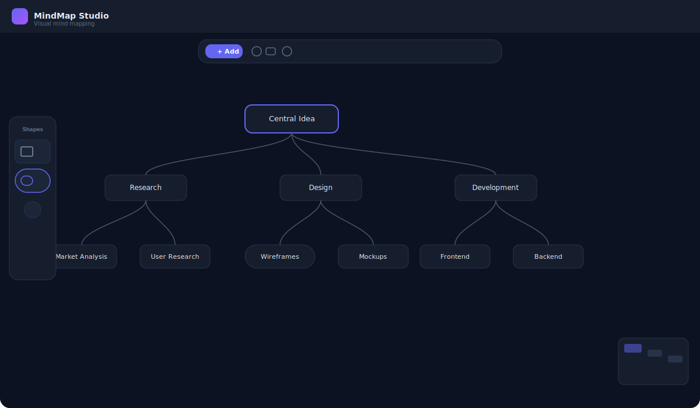

# MindMap Studio

A professional visual mind mapping tool built with Next.js and Tauri.



## Download

Grab the latest release for your platform:

| Platform | Download | Size |
|----------|----------|------|
| **macOS (Apple Silicon)** | [mindmap-studio-aarch64.dmg](https://github.com/officialnullobjectweb/mindmap-studio/releases/latest/download/mindmap-studio-aarch64.dmg) | ~5 MB |
| **macOS (Intel)** | [mindmap-studio-x64.dmg](https://github.com/officialnullobjectweb/mindmap-studio/releases/latest/download/mindmap-studio-x64.dmg) | ~5 MB |
| **Windows** | [mindmap-studio-windows.exe](https://github.com/officialnullobjectweb/mindmap-studio/releases/latest/download/mindmap-studio-windows.exe) | ~8 MB |
| **Linux (AppImage)** | [mindmap-studio-linux.AppImage](https://github.com/officialnullobjectweb/mindmap-studio/releases/latest/download/mindmap-studio-linux.AppImage) | ~10 MB |
| **Linux (Debian)** | [mindmap-studio-linux.deb](https://github.com/officialnullobjectweb/mindmap-studio/releases/latest/download/mindmap-studio-linux.deb) | ~8 MB |

## Features

- **5+ Shape Types**: Rectangle, Rounded, Circle, Diamond, Pill, Hexagon, and more
- **Markdown Import**: Paste markdown lists to create mind maps instantly
- **Multiple Export Formats**: HTML, SVG, PNG, JPG, PDF, JSON
- **Color Wheel**: Full HSL color picker with presets
- **Dark/Light Theme**: Toggle between themes
- **Keyboard Shortcuts**: `N` Add, `Del` Delete, `⌘Z` Undo, `⌘D` Duplicate, `⌘A` Select All
- **Drag & Drop**: Drag shapes from panel to canvas
- **Collapse/Expand**: Hide child nodes for step-by-step views
- **Auto Layout**: Automatic node arrangement
- **Right-Click Menu**: Context-aware actions
- **Multi-Select**: Ctrl+Click, Shift+Drag, Ctrl+A

## Quick Start

### Web Version
Visit [mindmap-studio.vercel.app](https://mindmap-studio.vercel.app)

### Desktop App
1. Download the installer for your platform from the releases page
2. Run the installer
3. Open MindMap Studio

### Development

```bash
# Install dependencies
npm install

# Run in development mode (web)
npm run dev

# Run in development mode (desktop)
npm run tauri:dev

# Build for current platform
npm run tauri:build
```

## Keyboard Shortcuts

| Key | Action |
|-----|--------|
| `N` | Add new node |
| `Del` / `Backspace` | Delete selected |
| `⌘Z` | Undo |
| `⌘⇧Z` | Redo |
| `⌘D` | Duplicate |
| `⌘A` | Select all |
| `L` | Auto layout |
| `Esc` | Cancel / deselect |

## Tech Stack

| Layer | Technology |
|-------|-----------|
| Frontend | Next.js, React, Tailwind CSS |
| Canvas | React Flow |
| State | Zustand |
| Desktop | Tauri 2 (Rust) |
| Export | html-to-image, jsPDF |

## License

MIT © FRAMD Studio
