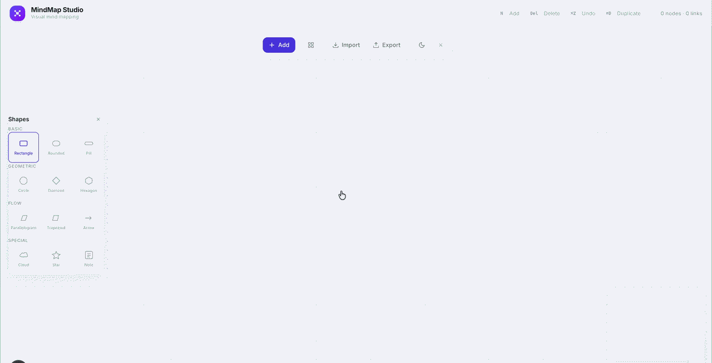

<p align="center">
  
</p>

<h1 align="center">MindMap Studio</h1>

<p align="center">
  <strong>Professional visual mind mapping tool</strong><br/>
  <sub>Import markdown · Export anywhere · Think visually</sub>
</p>

<p align="center">
  <a href="https://github.com/officialnullobjectweb/mindmap-studio/releases/latest"></a>
  <a href="https://github.com/officialnullobjectweb/mindmap-studio/blob/main/LICENSE"></a>
  <a href="https://github.com/officialnullobjectweb/mindmap-studio/actions"></a>
</p>

<br/>

<p align="center">
  
</p>

<br/>

---

## Download

<p align="center">

| Platform | Installer |
|----------|-----------|
| **macOS (Apple Silicon)** | <a href="https://github.com/officialnullobjectweb/mindmap-studio/releases/download/v1.0.0/mindmap-studio_1.0.0_aarch64.dmg"></a> |
| **macOS (Intel)** | <a href="https://github.com/officialnullobjectweb/mindmap-studio/releases/download/v1.0.0/mindmap-studio_1.0.0_x64.dmg"></a> |
| **Windows** | <a href="https://github.com/officialnullobjectweb/mindmap-studio/releases/download/v1.0.0/mindmap-studio_1.0.0_x64-setup.exe"></a> |
| **Linux (AppImage)** | <a href="https://github.com/officialnullobjectweb/mindmap-studio/releases/download/v1.0.0/mindmap-studio_1.0.0_amd64.AppImage"></a> |
| **Linux (Debian)** | <a href="https://github.com/officialnullobjectweb/mindmap-studio/releases/download/v1.0.0/mindmap-studio_1.0.0_amd64.deb"></a> |

</p>

---

## Features

| Feature | Description |
|---------|-------------|
| **Markdown Import** | Paste any markdown list and get an instant mind map |
| **Export Formats** | HTML · SVG · PNG · JPG · PDF · JSON |
| **Color Wheel** | Full HSL color picker with hex code input |
| **15+ Shapes** | Rectangle, Rounded, Circle, Diamond, Pill, Hexagon, Cloud, Star, and more |
| **Dark / Light Theme** | One-click theme toggle with smooth transitions |
| **Drag & Drop** | Drag shapes from the panel onto the canvas |
| **Collapse Nodes** | Hide child nodes for step-by-step walkthroughs |
| **Keyboard Shortcuts** | `N` · `Del` · `⌘Z` · `⌘D` · `⌘A` · `L` |

---

## Keyboard Shortcuts

| Key | Action |
|-----|--------|
| `N` | Add new node |
| `Del` | Delete selected |
| `⌘Z` | Undo |
| `⌘⇧Z` | Redo |
| `⌘D` | Duplicate |
| `⌘A` | Select all |
| `L` | Auto layout |
| `Esc` | Cancel / deselect |

---

## Tech Stack

| Layer | Technology |
|-------|-----------|
| Frontend | Next.js, React, Tailwind CSS |
| Canvas | React Flow |
| State | Zustand |
| Desktop | Tauri 2 + Rust |
| Export | html-to-image, jsPDF |

---

## Development

```bash
# Install
npm install

# Run (web)
npm run dev

# Run (desktop)
npm run tauri:dev

# Build desktop app
npm run tauri:build
```

---

## License

[MIT](https://github.com/officialnullobjectweb/mindmap-studio/blob/main/LICENSE) — FRAMD Studio
